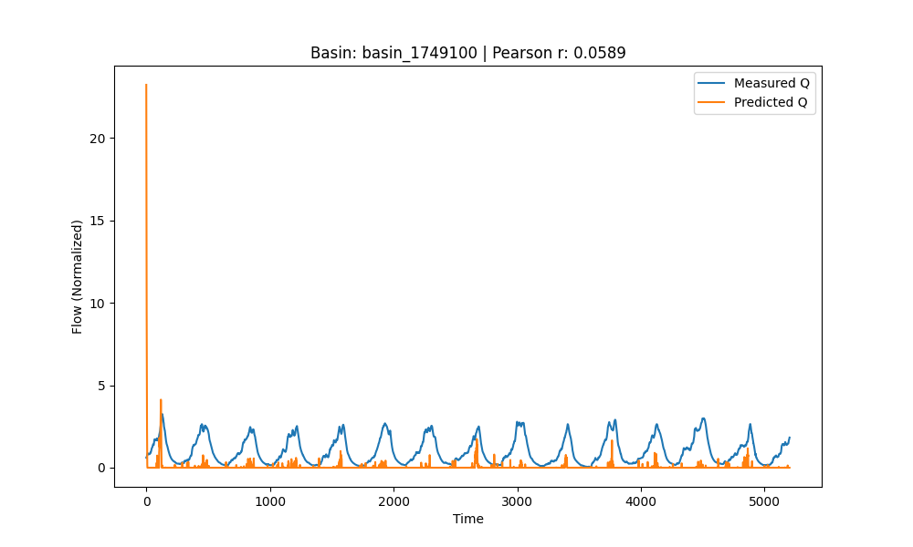

# Water Movement Model

## Overview

The **Water Movement Model** is a computational tool designed to simulate and analyze the flow of water through drainage basins. By leveraging hydrological data such as flow rates, temperature, precipitation, evapotranspiration (ET), and potential evapotranspiration (PET), the model employs nonlinear least squares regression to fit parameters that describe water storage and movement within a basin. This simulation aids in understanding hydrological processes, predicting water availability, and managing water resources effectively.

## Table of Contents

- [Overview](#overview)
- [Background](#background)
- [Project Structure](#project-structure)
- [Installation](#installation)
- [Usage](#usage)
- [Model Equations](#model-equations)
- [Results](#results)
- [Troubleshooting](#troubleshooting)
- [License](#license)

## Background

Hydrology, the study of water movement, distribution, and quality in the Earth's atmosphere and surface, plays a crucial role in environmental management, agriculture, and urban planning. Understanding how water moves through drainage basins helps in predicting floods, managing water resources, and assessing the impacts of climate change.

The **Water Movement Model** simulates the storage and flow of water within a basin using a set of mathematical equations derived from hydrological principles. By fitting these equations to observed data, the model estimates parameters that characterize the basin's response to various hydrological inputs.

## Project Structure

```
# Water Movement Model

## Overview

The **Water Movement Model** is a computational tool designed to simulate and analyze the flow of water through drainage basins. By leveraging hydrological data such as flow rates, temperature, precipitation, evapotranspiration (ET), and potential evapotranspiration (PET), the model employs nonlinear least squares regression to fit parameters that describe water storage and movement within a basin. This simulation aids in understanding hydrological processes, predicting water availability, and managing water resources effectively.

## Table of Contents

- [Overview](#overview)
- [Background](#background)
- [Project Structure](#project-structure)
- [Installation](#installation)
- [Usage](#usage)
- [Model Equations](#model-equations)
- [Results](#results)
- [Troubleshooting](#troubleshooting)
- [License](#license)

## Background

Hydrology, the study of water movement, distribution, and quality in the Earth's atmosphere and surface, plays a crucial role in environmental management, agriculture, and urban planning. Understanding how water moves through drainage basins helps in predicting floods, managing water resources, and assessing the impacts of climate change.

The **Water Movement Model** simulates the storage and flow of water within a basin using a set of mathematical equations derived from hydrological principles. By fitting these equations to observed data, the model estimates parameters that characterize the basin's response to various hydrological inputs.

## Project Structure

````plaintext
water_movement_model/
├── configs
│   ├── config_trf.yaml
│   ├── config_dogbox.yaml
│   └── config_lm.yaml
├── data
│   ├── basin_1749100.csv
│   └── basin_4136300.csv
├── requirements.txt
├── results
│   ├── basin_1749100/
│   │   ├── Q_comparison.png
│   │   ├── thetas.npy
│   │   └── correlationCoefficients.npy
│   └── basin_4136300/
│       ├── Q_comparison.png
│       ├── thetas.npy
│       └── correlationCoefficients.npy
├── scripts
│   ├── fit_model.py
│   └── utils.py
├── run_all.sh
└── README.md

```

- **configs/**: Contains configuration files defining parameter bounds and optimization settings.
- **data/**: Stores CSV files with hydrological data for different basins.
- **results/**: Outputs from the model, including fitted parameters and comparison plots.
- **scripts/**: Python scripts for data processing and model fitting.
- **run_all.sh**: Shell script to batch process multiple basin data files.
- **requirements.txt**: Lists Python dependencies.
- **README.md**: This documentation file.

## Installation

To set up the environment and prepare the project for use, follow these steps:

### 1. Clone the Repository

```bash
git clone https://github.com/yourusername/water_movement_model.git
cd water_movement_model
```

### 2. Create and Activate a Virtual Environment

It's recommended to use a Python virtual environment to manage dependencies.

```bash
# Create a virtual environment named 'venv'
python3 -m venv venv

# Activate the virtual environment
# On macOS/Linux:
source venv/bin/activate

# On Windows:
venv\Scripts\activate
```

### 3. Install Dependencies

Install the required Python packages using `pip`:

```bash
pip install -r requirements.txt
```

### 4. Prepare Data

Ensure that your basin CSV files are placed in the `data/` directory. Each CSV file should contain the following columns:

- `Date`: Date of the observation.
- `flow`: Measured flow rate.
- `average temperature (C)`: Average temperature in Celsius.
- `precipitation`: Precipitation amount.
- `ET`: Evapotranspiration.
- `PET`: Potential evapotranspiration.

## Usage

The project includes shell scripts, such as `run_all_lm.sh`, to process all basin data files in batch. This script utilizes the default configuration file for all basins.

### Running the Batch Script

1. **Ensure the Script is Executable**

   ```bash
   chmod +x run_all_lm.sh
   ```

2. **Execute the Script**

   Run the script from the **project root directory**:

   ```bash
   ./run_all_lm.sh
   ```

   The script will process each basin CSV file, fit the model parameters, and save the results in the `results/` directory.

### Understanding the Output

For each basin, the following outputs are generated:

- **Q_comparison.png**: A plot comparing measured and predicted flow rates.
- **thetas.npy**: A NumPy array containing the fitted model parameters.
- **correlationCoefficients.npy**: A NumPy array with the Pearson correlation coefficient between measured and predicted flows.

## Model Equations

The **Water Movement Model** is based on the water balance principle, which accounts for various hydrological inputs and outputs within a drainage basin. The model simulates water storage (`W`) and flow (`Q`) over time using the following set of equations:

### 1. Water Balance Equation

The rate of change of water storage in the basin is given by:

\[
\frac{dW}{dt} = P - Q - ET
\]

Where:
- \( W \) = Water storage (e.g., groundwater)
- \( P \) = Precipitation input
- \( Q \) = Outflow or discharge
- \( ET \) = Evapotranspiration loss

### 2. Outflow (\( Q \)) Equation

Outflow is modeled as a function of water storage and other parameters:

\[
Q = \theta_0 \cdot W \cdot \frac{e^{-\theta_1}}{1 + e^{-(\theta_2 \cdot T + \theta_3)}}
\]

Where:
- \( \theta_0, \theta_1, \theta_2, \theta_3 \) = Model parameters
- \( T \) = Temperature

### 3. Evapotranspiration (\( ET \)) Equation

Evapotranspiration is influenced by potential evapotranspiration and temperature:

\[
ET = \theta_6 \cdot PET \cdot (1 + e^{\theta_4} \cdot m)
\]

Where:
- \( \theta_4, \theta_6 \) = Model parameters
- \( PET \) = Potential evapotranspiration
- \( m \) = A parameter representing moisture conditions

### 4. Water Storage Change (\( \frac{dW}{dt} \)) Equation

Combining the above equations, the rate of change of water storage becomes:

\[
\frac{dW}{dt} = P \cdot \theta_5 - Q - ET
\]

Where:
- \( \theta_5 \) = Parameter scaling precipitation input

### 5. Derivative of Water Storage (\( W' \))

The derivative function used in the model:

\[
W' = P \cdot \theta_5 - \theta_0 \cdot W \cdot \frac{e^{-\theta_1}}{1 + e^{-(\theta_2 \cdot T + \theta_3)}} - \theta_6 \cdot PET \cdot (1 + e^{\theta_4} \cdot m)
\]

### 6. Model Simulation

Using numerical integration (e.g., Euler's method), the model simulates water storage and outflow over discrete time steps based on the above equations.

## Results

After running the model, results are saved in the `results/` directory for each basin. The key outputs include:

- **Fitted Parameters (`thetas.npy`)**: Contains the estimated values for all model parameters (\( \theta_0 \) to \( \theta_6 \), \( w_0 \), and \( m \)).

  ```python
  import numpy as np
  thetas = np.load('results/basin_1749100/thetas.npy')
  print(thetas)
  ```

- **Correlation Coefficient (`correlationCoefficients.npy`)**: Indicates the Pearson correlation between measured and predicted flow rates.

  ```python
  correlations = np.load('results/basin_1749100/correlationCoefficients.npy')
  print(correlations)
  ```

- **Flow Comparison Plot (`Q_comparison.png`)**: Visual representation of how well the model's predictions align with observed flow data.

### Example Plot



*Figure: Measured vs. Predicted Flow Rates for Basin 1749100*

## Troubleshooting

### Common Issues and Solutions

1. **Unrecognized Arguments Error**

   **Error Message:**
   ```
   fit_model.py: error: unrecognized arguments: --output_dir /path/to/output
   ```

   **Solution:**
   Ensure that `fit_model.py` has been updated to accept the `--output_dir` argument. Refer to the [Usage](#usage) section and verify that the script includes this argument in its argument parser.

2. **ConstantInputWarning:**

   **Warning Message:**
   ```
   ConstantInputWarning: An input array is constant; the correlation coefficient is not defined.
   cc, p = pearsonr(qs_pred, flow)
   ```

   **Solution:**
   - Verify that your CSV data contains sufficient variability in the `flow` measurements.
   - Ensure that there are no missing or constant values after data preprocessing.
   - Check the normalization process in `utils.py` to prevent division by zero or scaling issues.

3. **Optimization Failure:**

   **Error Message:**
   ```
   Optimization failed: <reason>
   ```

   **Solution:**
   - Ensure that the initial parameter guesses (`theta_0`) are within the specified bounds.
   - Check for data inconsistencies or missing values in your CSV files.
   - Review the debug logs for detailed information on parameter sizes and values.

4. **Missing Required Columns:**

   **Error Message:**
   ```
   Missing required column: <column_name>
   ```

   **Solution:**
   Ensure that all CSV files contain the necessary columns: `Date`, `flow`, `average temperature (C)`, `precipitation`, `ET`, and `PET`.

### Tips for Debugging

- **Enable Debug Logging:**
  
  Temporarily set the logging level to `DEBUG` in `fit_model.py` to obtain detailed logs.
  
  ```python
  logging.basicConfig(level=logging.DEBUG, format='%(asctime)s - %(levelname)s - %(message)s')
  ```
  
- **Validate Data:**
  
  Use Python or spreadsheet software to inspect your CSV files for anomalies or inconsistencies.

## License

This project is licensed under the [MIT License](LICENSE). See the [LICENSE](LICENSE) file for details.

---

